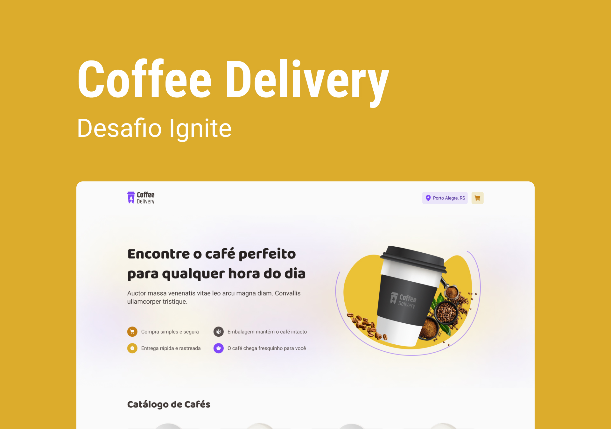

<div align="center" id="top"> 
  

&#xa0;

  <!-- <a href="https://coffeedelivery.netlify.app">Demo</a> -->
</div>

<h1 align="center">Coffee Delivery</h1>

<p align="center">
  

  

  

  

</p>

Status

<h4 align="center"> 
	🚧  Coffee Delivery 🚀 Under construction...  🚧
</h4>

<hr>

<p align="center">
  <a href="#dart-about">About</a> &#xa0; | &#xa0; 
  <a href="#sparkles-features">Features</a> &#xa0; | &#xa0;
  <a href="#rocket-technologies">Technologies</a> &#xa0; | &#xa0;
  <a href="#white_check_mark-requirements">Requirements</a> &#xa0; | &#xa0;
  <a href="#checkered_flag-starting">Starting</a> &#xa0; | &#xa0;
  <a href="#memo-license">License</a> &#xa0; | &#xa0;
  <a href="https://github.com/tarcisiodelmondes" target="_blank">Author</a>
</p>

<br>

## :dart: About

Coffee Delivery is an Ignite challenge. Where do we have to build a
coffee delivery app with React

## :sparkles: Features

:heavy_check_mark: Add item to cart
:heavy_check_mark: Remove item from cart
:heavy_check_mark: Do not add more items to the cart if out of stock
:heavy_check_mark: Finalize purchase

## :rocket: Technologies

The following tools were used in this project:

- [Node.js](https://nodejs.org/en/)
- [Vite](https://vitejs.dev/)
- [React](https://pt-br.reactjs.org/)
- [TypeScript](https://www.typescriptlang.org/)
- [Mirage](https://miragejs.com/)

## :white_check_mark: Requirements

Before starting :checkered_flag:, you need to have [Git](https://git-scm.com) and [Node](https://nodejs.org/en/) installed.

## :checkered_flag: Starting

```bash
# Clone this project
$ git clone https://github.com/tarcisiodelmondes/ignite-challenge-coffee-delivery

# Access
$ cd ignite-challenge-coffee-delivery

# Install dependencies
$ yarn

# Run the project
$ yarn dev

# The server will initialize in the <http://localhost:3000>
```

## :memo: License

This project is under license from MIT. For more details, see the [LICENSE](LICENSE.md) file.

Made with :heart: by <a href="https://github.com/tarcisiodelmondes" target="_blank">Tarcísio Delmondes</a>

&#xa0;

<a href="#top">Back to top</a>
